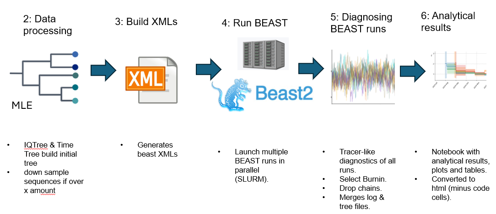
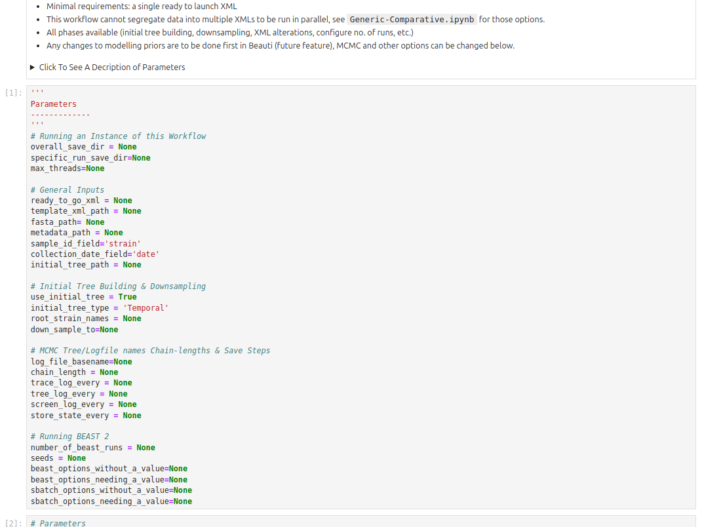
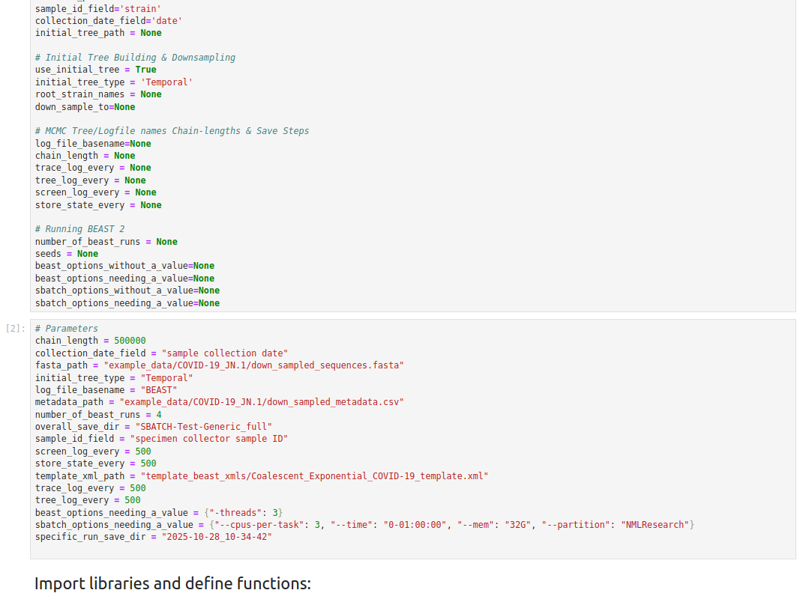
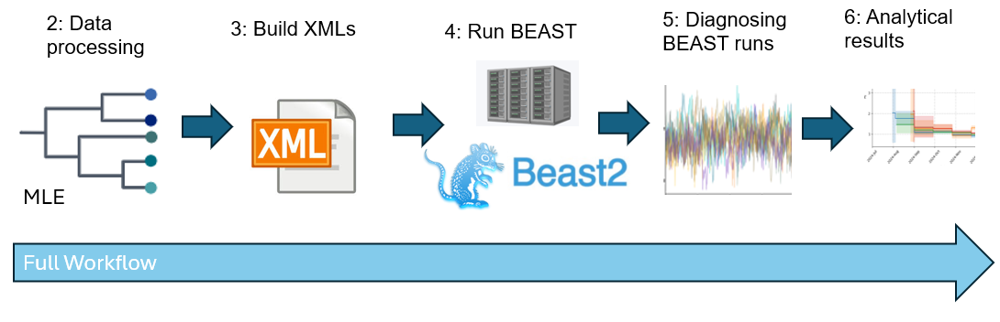
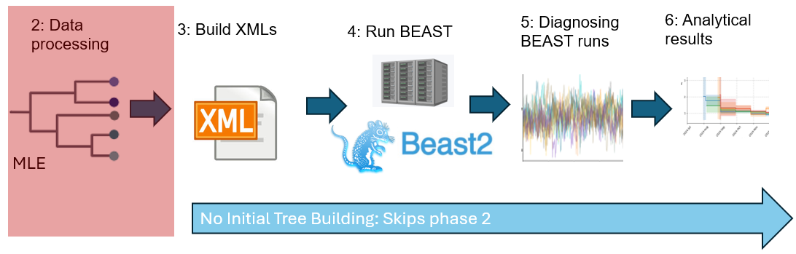
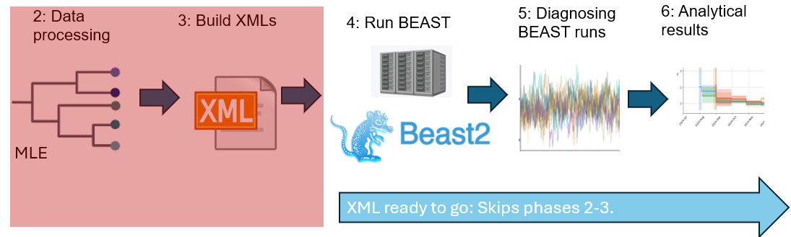

# Objectives  
- This workflow is intended for use with *any beast 2 xml*.   
- This workflow does *not* segregate or sort data into separate xml_sets (see [Glossary of Terms](Glossary-of-Terms.md#xml-set)). 
- Therefore, it does *not* use phase 1 notebooks.

## Phases Used in Workflow


# Workflow Variations
There are three variations of the Generic workflow that can be run:
1. [Full Workflow](#variation-1-running-the-workflow-in-full)
2. [Skipping initial tree and using BEAST 2's initial tree](#variation-2-skip-building-an-initial-tree-and-use-beast-2s-initial-tree-instead)
3. [Ready to go xml](#variation-3-using-a-ready-to-go-xml)

# Workflow Inputs  
- This workflow will work with any BEAST 2 [template-xml](Glossary-of-Terms.md#template-xml) or a [ready-to-go-xml](Glossary-of-Terms.md#ready-to-go-xml).
  - A [template-xml](Glossary-of-Terms.md#template-xml) has the sequences from a fasta file inserted, and depending on other
  settings an initial tree added before being run by BEAST 2.  
  - A [ready-to-go-xml](Glossary-of-Terms.md#ready-to-go-xml) BDSky-Serial xml will simply be run by BEAST 2.  

For a more detailed overview of the [Generic workflow notebook](https://github.com/m-d-grunnill/BEAST_pype/blob/main/workflows/Generic.ipynb) workflow's parameters see:
* The top of [Generic workflow notebook](https://github.com/m-d-grunnill/BEAST_pype/blob/main/workflows/Generic.ipynb)
* The template parameterization yaml at [parameters/Template_BDSKY-Serial.yml](https://github.com/m-d-grunnill/BEAST_pype/blob/main/parameters/Template_BDSKY-Serial.yml).


# Running the Generic Workflow

## Setting up a Parameter Yml file  
Before running the Generic Workflow you may wish to construct your own Parameter Yaml to parameterize the workflow.
A template Parameter Yaml has been provided for use with the  [Generic workflow notebook](https://github.com/m-d-grunnill/BEAST_pype/blob/main/workflows/Generic.ipynb) at 
[parameters/Template_Generic.yml](https://github.com/m-d-grunnill/BEAST_pype/blob/main/parameters/Template_Generic.yml).
**Important**: Copy and save the template yml with a different name BEFORE editing. 

 [Template_Generic.yml](https://github.com/m-d-grunnill/BEAST_pype/blob/main/parameters/Template_Generic.yml) is blank for many values. This means it will not work. To change this in your copy of the template the edit:
* REGARDLESS OF WORKFLOW VARIATION.
  * The 'Running an Instance of this Workflow' section.
  * The 'Running BEAST 2' section.
  * The 'Using a GPU when running BEAST 2' section.
  * The 'Use multiple cores/threads when running BEAST 2' section.
  * The 'Using a SLURM when running BEAST 2' section.
* For [FULL WORKFLOW](#variation-1-running-the-workflow-in-full)
  * The 'General Inputs' section:
    * Comment out ready_to_go_xml.
    * Fill in rest as needed.
  * The 'Add pre-made Initial Tree' Section.
  * The 'Initial Tree Building & Downsampling' Section.
  * The 'MCMC Tree/Logfile names Chain-lengths & Save Steps' section.
* For [SKIPPING INITIAL TREE AND USING BEAST 2'S INITIAL TREE](#variation-2-skip-building-an-initial-tree-and-use-beast-2s-initial-tree-instead)
  * The 'General Inputs' section:
    * Comment out ready_to_go_xml.
    * Fill in rest as needed.
  * Comment out 'Add pre-made Initial Tree' Section.
  * Set 'use_initial_tree' to False and comment out the rest of the 'Initial Tree Building & Downsampling' section.
  * The 'MCMC Tree/Logfile names Chain-lengths & Save Steps' section.
* For [READY TO GO XML](#variation-3-using-a-ready-to-go-xml)
  * The 'General Inputs' section:
    * Fill in ready_to_go_xml.
    * Comment out the rest of this section.
  * Comment out the sections:
    * 'Add pre-made Initial Tree'
    * 'Initial Tree Building & Downsampling'
    * 'MCMC Tree/Logfile names Chain-lengths & Save Steps'

## Examples of running the Generic Workflow 

Here we demonstrate the workflow outputs via running the example parameterization in [parameters/sbatch_run_examples](https://github.com/m-d-grunnill/BEAST_pype/tree/main/parameters/sbatch_run_examples) and [parameters/locally_run_examples](https://github.com/m-d-grunnill/BEAST_pype/tree/main/parameters/locally_run_examples). Launching any of the workflows with any of the example parameterization demonstrated here will create a directory starting with either `SBATCH-Test-Generic_*` or `LOCAL-Test-Generic_*` containing a **time stamped** folder (format 'YYYY-MM-DD_hour-min-sec').  

If you [launched a workflow via slurm](Overview-of-running-workflows.md#running-on-hpc-via-sbatch), shortly after the Generic workflow is 
launched a running copy of [Generic workflow notebook](https://github.com/m-d-grunnill/BEAST_pype/blob/main/workflows/Generic.ipynb)
should appear in the **time stamped** folder. 

If you [launched a workflow locally via command line](Overview-of-running-workflows.md#running-locally-via-papermill) the
running copy of [Generic workflow notebook](https://github.com/m-d-grunnill/BEAST_pype/blob/main/workflows/Generic.ipynb) should appear 
but be at the path you gave in the argument `PATH_TO_OUTPUT_NOTEBOOK.ipnyb`.

The top code cell of this notebook will have a new code cell inserted below which replaces the default parameter values
in [Generic workflow notebook](https://github.com/m-d-grunnill/BEAST_pype/blob/main/workflows/Generic.ipynb) with the  values specified in
your parameterization yml:
  
  

### Workflow Outputs (in the Time Stamped Folder)
The 'time stamped' folder will gradually fill with:
1. A running copy of [Phase-2i-IQTree-Building.ipynb](https://github.com/m-d-grunnill/BEAST_pype/src/beast_pype/workflow_modules/Phase-2i-IQTree-Building.ipynb).
2. The folder `initial_trees`. This will house a IQTree tree and the TimeTree tree that will be inserted into the template xml (Phase 3).
3. A running copy of [Phase-2i-IQTree-Correction.ipynb](https://github.com/m-d-grunnill/BEAST_pype/src/beast_pype/workflow_modules/Phase-2i-IQTree-Correction.ipynb)
4. A running copy of [Phase-2ii-TreeTime-and-Down-Sampling.ipynb](https://github.com/m-d-grunnill/BEAST_pype/src/beast_pype/workflow_modules/Phase-2ii-TreeTime-and-Down-Sampling.ipynb)
5. A running copy of the phase 3 [Phase-3-Gen-Generic-xml.ipynb](https://github.com/m-d-grunnill/BEAST_pype/src/beast_pype/workflow_modules/Phase-3-Gen-Generic-xml.ipynb).
6. A running copy of a phase 4 notebook:
   * If running via sbatch: [Phase-4-SBATCH-Running-BEAST.ipynb](https://github.com/m-d-grunnill/BEAST_pype/src/beast_pype/workflow_modules/Phase-4-SBATCH-Running-BEAST.ipynb).
   * If running locally [Phase-4-GNU-Parallel-Running-BEAST.ipynb](https://github.com/m-d-grunnill/BEAST_pype/src/beast_pype/workflow_modules/Phase-4-GNU-Parallel-Running-BEAST.ipynb). 
7. The folder `beast_outputs`. This houses all beast outputs (log files, .out files, tree files, etc.).
8. A copy of [Phase-5-Diagnosing-Outputs-and-Generate-Report.ipynb](https://github.com/m-d-grunnill/BEAST_pype/src/beast_pype/workflow_modules/Phase-5-Diagnosing-Outputs-and-Generate-Report.ipynb)
   * If running via sbatch this will apper after shortly the folder `beast_outputs`.
   * If running locally this will appear after all the BEAST runs have finished. 


#### Diagnostics Report and BEAST_pype Report (summary of outputs)
The copy of [Phase-5-Diagnosing-Outputs-and-Generate-Report.ipynb](https://github.com/m-d-grunnill/BEAST_pype/src/beast_pype/workflow_modules/Phase-5-Diagnosing-Outputs-and-Generate-Report.ipynb) needs to be run **manually**. 
Instructions for this are presented in the notebook itself, once all the BEAST runs have finished.

Running will [Phase-5-Diagnosing-Outputs-and-Generate-Report.ipynb](https://github.com/m-d-grunnill/BEAST_pype/src/beast_pype/workflow_modules/Phase-5-Diagnosing-Outputs-and-Generate-Report.ipynb) will generate:
* The merged log file 'merged.log' in the folder `beast_outputs`.
* The merged tree file 'merged.trees' in the folder `beast_outputs`.
* The 'outputs_and_reports' folder containing:
  * 'BEAST_runtimes.csv' a dataframe of the runtimes of BEAST 2 runs (scrapped from BEAST 2 screen output files).
  * The BEAST_pype-Report.ipynb notebook this contains summary figures and statistics of the results from running BEAST_pype.
  * The BEAST_pype-Report.html. This a html version of BEAST_pype-Report.ipynb with the code cells removed.
  * If you are running BEAST_pype on via sbatch the file 'BEAST_slurm_stats.csv' should appear. This is dataframe of various metrics recorded by slurm as it carried out your BEAST runs. 


### Checking on Progress
The progress of the MCMC BEAST 2 chains can be checked via opening the files
`run-with-seed-*.out` (* being the seed being used for that run).

If you [launched a workflow via slurm](Overview-of-running-workflows.md#running-on-hpc-via-sbatch), 
the slurm jobs running the workflow and BEAST can be checked open using:
```bash
   squeue --format="%.18i %.9P %.30j %.8u %.8T %.10M %.9l %.6D %R" --me
```


## Variations of the Generic Workflow

There several variations available for running the Generic Workflow.

### Variation 1: Running the Workflow in Full



The examples in the two sections below will run the variation of the workflow with
the parameters set in [parameters/sbatch_run_examples/Generic_full.yml](https://github.com/m-d-grunnill/BEAST_pype/blob/main/parameters/sbatch_run_examples/Generic_full.yml) (for running via sbatch) and [parameters/locally_run_examples/Generic_full.yml](https://github.com/m-d-grunnill/BEAST_pype/blob/main/parameters/locally_run_examples/Generic_full.yml) (for running locally). These examples will
also create the directory `SBATCH-Test-Generic_full` if running via sbatch or `Local-Test-Generic_full` if running locally. All the outputs from running the workflow will be saved in either of these files.


### Running on a HPC via SBATCH
To run the full version of [Generic workflow](https://github.com/m-d-grunnill/BEAST_pype/blob/main/workflows/Generic.ipynb) from command line via slurm's `sbatch` enter the following command:
```bash
cd LOCATION_YOU_CLONED_THE_BEAST_PYPE_REPO_TO
sbatch run-workflow.slurm workflows/Generic.ipynb parameters/sbatch_run_examples/Generic_full.yml
```


##### Running Locally via Papermill
To run the full version of [Generic workflow](https://github.com/m-d-grunnill/BEAST_pype/blob/main/workflows/Generic.ipynb) from command line via papermill enter the following command:
```bash
cd LOCATION_YOU_CLONED_THE_BEAST_PYPE_REPO_TO
conda activate beast_pype
papermill workflows/Generic.ipynb Generic.ipynb -f parameters/locally_run_examples/Generic_full.yml
```

> **NOTE:** if the argument `max_threads` is not given in your parameter yml file when running locally,
> beast_pype will limit the maximum cores being used to all the available cores -1.
> The number of cores being used at one time depends on the phase of the workflow running.

## Variation 2: Skip building an initial tree and use BEAST 2's initial tree instead



The full [Generic workflow](https://github.com/m-d-grunnill/BEAST_pype/blob/main/workflows/Generic.ipynb) creates an initial tree using IQTree and TreeTime (in phases 2i and 2ii, respectively) and uses the initial tree in generating a BEAST 2 xml from the template xml. This initial tree does speed up the convergence of MCMC chains when running BEAST 2. However, this is slightly against the spirit of MCMC analysis (see [BEAST 2 documentation](https://www.beast2.org/2014/07/28/all-about-starting-trees)).  

### Modification to Input 
[Generic workflow](https://github.com/m-d-grunnill/BEAST_pype/blob/main/workflows/Generic.ipynb) can skip building the initial tree building phase if the line `use_initial_tree: False` is the parameter yml. See [parameters/sbatch_run_examples/Test-Generic_no-initial-tree.yml](https://github.com/m-d-grunnill/BEAST_pype/blob/main/parameters/sbatch_run_examples/Generic_no-initial-tree.yml) and [parameters/locally_run_examples/Generic_no-initial-tree.yml](https://github.com/m-d-grunnill/BEAST_pype/blob/main/parameters/locally_run_examples/Generic_no-initial-tree.yml) for examples. 

> **REMINDER:** You can alter a copy of `[parameters/Template_Generic.yml](https://github.com/m-d-grunnill/BEAST_pype/blob/main/parameters/Template_Generic.yml) so the initial tree building phase can be skipped. See [Setting up a parameter yml file](#setting-up-a-parameter-yml-file-) section above.

### Launching via Command Line
The examples in the two sections below will run the variation of the workflow with
the parameters set in [parameters/sbatch_run_examples/Generic_no-initial-tree.yml](https://github.com/m-d-grunnill/BEAST_pype/blob/main/parameters/sbatch_run_examples/Generic_no-initial-tree.yml) (for running via sbatch) and [parameters/locally_run_examples/Generic_no-initial-tree.yml](https://github.com/m-d-grunnill/BEAST_pype/blob/main/parameters/locally_run_examples/Generic_no-initial-tree.yml) (for running locally). These examples will
also create the directory `SBATCH-Test-Generic_no-initial-tree` if running via sbatch or `Local-Test-Generic_no-initial-tree` if running locally. All the outputs from running the workflow will be saved in either of these files.

#### Running on a HPC via SBATCH
To run the full version of [Generic workflow](https://github.com/m-d-grunnill/BEAST_pype/blob/main/workflows/Generic.ipynb) from command line via slurm's `sbatch` enter the following command:
```bash
cd LOCATION_YOU_CLONED_THE_BEAST_PYPE_REPO_TO
sbatch run-workflow.slurm workflows/Generic.ipynb parameters/sbatch_run_examples/Generic_no-initial-tree.yml
```

#### Running Locally via Papermill
To run the full version of [Generic workflow](https://github.com/m-d-grunnill/BEAST_pype/blob/main/workflows/Generic.ipynb) from command line via papermill enter the following command:
```bash
cd LOCATION_YOU_CLONED_THE_BEAST_PYPE_REPO_TO
conda activate beast_pype
papermill workflows/Generic.ipynb Generic.ipynb -f parameters/locally_run_examples/Generic_no-initial-tree.yml
```

> **NOTE:** if the argument `max_threads` is not given in your parameter yml file when running locally,
> beast_pype will limit the maximum cores being used to all the available cores -1.
> The number of cores being used at one time depends on the phase of the workflow running.

### Differences in Outputs
This variant of the [Generic workflow](https://github.com/m-d-grunnill/BEAST_pype/blob/main/workflows/Generic.ipynb) will then run the in the same manner as the full version but miss Phases 2i and 2ii as such the Phase-2i-IQTree.ipynb.  As such the following will be missing from the [Time Stamped Folder](#time-stamped-folder):
* [Phase-2i-IQTree.ipynb](https://github.com/m-d-grunnill/BEAST_pype/blob/main/src/beast_pype/workflow_modules/Phase-2i-IQTree-Building.ipynb)
* [Phase-2i-IQTree-Correction.ipynb](https://github.com/m-d-grunnill/BEAST_pype/blob/main/src/beast_pype/workflow_modules/Phase-2i-IQTree-Correction.ipynb) 
* [Phase-2ii-TreeTime-and-Down-Sampling.ipynb](https://github.com/m-d-grunnill/BEAST_pype/blob/main/src/beast_pype/workflow_modules/Phase-2ii-TreeTime-and-Down-Sampling.ipynb) 
* 'initial_trees' folder containing the outputs from phase 2.

## Variation 3: Using a ready to go xml



You may have a BEAST xml that you wish to run directly with the [Generic workflow](https://github.com/m-d-grunnill/BEAST_pype/blob/main/workflows/Generic.ipynb).  

### Modification to Input
This can be done by adding the variable `ready_to_go_xml` with the path to that BEAST xml in the parameter yml file.  
See [parameters/sbatch_run_examples/Test-Generic_xml-ready-to-go.yml](https://github.com/m-d-grunnill/BEAST_pype/blob/main/parameters/sbatch_run_examples/Generic_xml-ready-to-go.yml) and [parameters/locally_run_examples/Generic_xml-ready-to-go.yml](https://github.com/m-d-grunnill/BEAST_pype/blob/main/parameters/locally_run_examples/Generic_xml-ready-to-go.yml) for examples. 

> **REMINDER:** You can alter a copy of `[parameters/Template_Generic.yml](https://github.com/m-d-grunnill/BEAST_pype/blob/main/parameters/Template_Generic.yml) so a [ready-to-go-xml](Glossary-of-Terms.md#ready-to-go-xml) can be used. See [Setting up a parameter yml file](#setting-up-a-parameter-yml-file-) section above.

### Launching via Command Line
The examples in the two sections below will run the variation of the workflow with
the parameters set in [parameters/sbatch_run_examples/Generic_xml-ready-to-go.yml](https://github.com/m-d-grunnill/BEAST_pype/blob/main/parameters/sbatch_run_examples/Generic_xml-ready-to-go.yml) (for running via sbatch) and [parameters/locally_run_examples/Generic_xml-ready-to-go.yml](https://github.com/m-d-grunnill/BEAST_pype/blob/main/parameters/locally_run_examples/Generic_xml-ready-to-go.yml) (for running locally). These examples will
also create the directory `SBATCH-Test-Generic_xml-ready-to-go` if running via sbatch or `Local-Test-Generic_xml-ready-to-go` if running locally. All the outputs from running the workflow will be saved in either of these files.

#### Running on a HPC via SBATCH
To run the xml-ready-to-go version of [Generic workflow](https://github.com/m-d-grunnill/BEAST_pype/blob/main/workflows/Generic.ipynb) from command line via slurm's `sbatch` enter the following command:
```bash
cd LOCATION_YOU_CLONED_THE_BEAST_PYPE_REPO_TO
sbatch run-workflow.slurm workflows/Generic.ipynb parameters/sbatch_run_examples/Generic_xml-ready-to-go.yml
```

#### Running Locally via Papermill
To run the xml-ready-to-go version of [Generic workflow](https://github.com/m-d-grunnill/BEAST_pype/blob/main/workflows/Generic.ipynb) from command line via papermill enter the following command:
```bash
cd LOCATION_YOU_CLONED_THE_BEAST_PYPE_REPO_TO
conda activate beast_pype
papermill workflows/Generic.ipynb Generic.ipynb -f parameters/locally_run_examples/Generic_xml-ready-to-go.yml
```

> **NOTE:** if the argument `max_threads` is not given in your parameter yml file when running locally,
> beast_pype will limit the maximum cores being used to all the available cores -1.
> The number of cores being used at one time depends on the phase of the workflow running.

### Differences in Outputs
This variant of the [Generic workflow](https://github.com/m-d-grunnill/BEAST_pype/blob/main/workflows/Generic.ipynb) will then run the in will miss phases 2-3 and copy the xml you provided into the **time stamped** folder and use it for running the rest of the [Generic workflow](https://github.com/m-d-grunnill/BEAST_pype/blob/main/workflows/Generic.ipynb). As such the following will be missing from the [Time Stamped Folder](#time-stamped-folder):
* [Phase-2i-IQTree.ipynb](https://github.com/m-d-grunnill/BEAST_pype/blob/main/src/beast_pype/workflow_modules/Phase-2i-IQTree-Building.ipynb)
* [Phase-2i-IQTree-Correction.ipynb](https://github.com/m-d-grunnill/BEAST_pype/blob/main/src/beast_pype/workflow_modules/Phase-2i-IQTree-Correction.ipynb) 
* [Phase-2ii-TreeTime-and-Down-Sampling.ipynb](https://github.com/m-d-grunnill/BEAST_pype/blob/main/src/beast_pype/workflow_modules/Phase-2ii-TreeTime-and-Down-Sampling.ipynb) 
* [Phase-3-Gen-Generic-xml.ipynb](https://github.com/m-d-grunnill/BEAST_pype/blob/main/src/beast_pype/workflow_modules/Phase-3-Gen-Generic-xml.ipynb)
* 'initial_trees' folder containing the outputs from phase 2.  