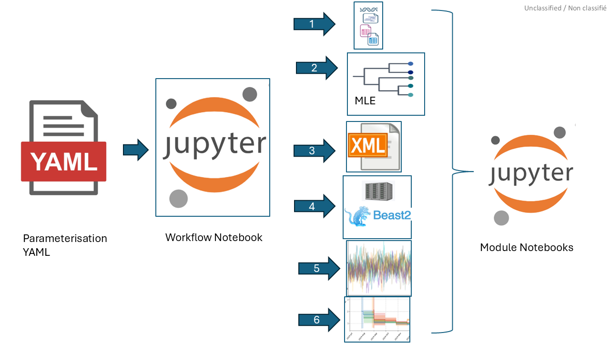
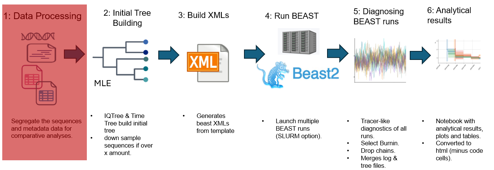

# Overview of Running Workflows]

BEAST_pype's workflows are currently in the form of jupyter notebooks that are run via
[papermill](https://papermill.readthedocs.io/en/latest/). Each of these workflows is parameterized by a parameter yml file and runs
further jupyter notebooks via [papermill](https://papermill.readthedocs.io/en/latest/) 
that act as the [modular phases](https://github.com/m-d-grunnill/BEAST_pype/tree/main/src/beast_pype/workflow_modules) of a workflow. 



Workflows progress along the following phases (many skip phase 1):



Most workflows have variations allowing you to
* Skip phases 1-3 if you have a BEAST 2 xml that is ready to go unaltered and run by BEAST 2.
* Skip phase 2 if you don't want to use a MLE tree for an initial tree when running BEAST 2.  

$${\color{red}\textbf{NOTE:}}$$ Phase 1 is sometimes skipped as a there maybe no need to sort or gather metadata depending on the workflow. 
It is expected that the user come prepared with the appropriate input data to run the BEAST_pype. 

# Running BEAST_pype Workflows

General steps:  
    1. Choose which template in the [parameters](https://github.com/m-d-grunnill/BEAST_pype/tree/main/parameters) directory you want to run.   
    2. Open the template Yaml (save it with new name in the `parameters` folder) and configure it  
    3. Follow running instructions below (based on which computer environment)   

## Running on HPC via SBATCH
### Before Launching BEAST_pype Workflows via Slurm's sbatch 

**BEFORE RUNNING THE EXAMPLES IN THIS WIKI** you **MAY** need to know which partition
to run a BEAST_pype workflow on. A list of the available partitions can be found using 
the slurm command `sinfo`. That being said it, maybe best to ask the administrator of 
the HPC you intend to run BEAST_pype on which partition to use.  

Once you know which partition to use you can alter line 11 of your copy of [run-workflow.slurm](https://github.com/m-d-grunnill/BEAST_pype/blob/main/run-workflow.slurm)
to read:
```bash
#SBATCH -p NAME_OF_PARTITION_TO_USE
```
`run-workflow.slurm` is a specialized [shell script for running sbatch jobs](https://hpc-uit.readthedocs.io/en/latest/jobs/examples.html). The
top of `run-workflow.slurm` has `#SBATCH` arguments that you may
wish to alter or add to (see [slurm's sbatch documentation](https://slurm.schedmd.com/sbatch.html)) depending on a particular run of a BEAST_pype workflow.  

### Running run-workflow.slurm via SBATCH

If you have access to an HPC running 
[slurm](https://slurm.schedmd.com/overview.html) beast_pype workflows are 
launched using Slurm's sbatch via the following form:
```bash
sbatch run-workflow.slurm PATH_TO_WORKFLOW.ipnyb PATH_TO_PARAMETERS.yml
```


## Running Locally via Papermill

Alternatively, you can run a BEAST_pype notebook locally from terminal. First 
make sure you are in the beast_pype conda environment (`conda activate beast_pype`) 
Then you can run a beast_pype workflow via:
```bash
papermill PATH_TO_WORKFLOW.ipnyb PATH_TO_OUTPUT_NOTEBOOK.ipnyb -f PATH_TO_PARAMETERS.yml
```
**Note** if not specified BEAST_pype will all but one of the CPU cores available when 
running all the BEAST repeats. The maximum number of cores to use when running the
BEAST repeats can be set via max_threads in any parameter yml. 

Other differences from running via Slurm's `sbatch`:
* The running copy ot the notebook is saved at `PATH_TO_OUTPUT_NOTEBOOK.ipnyb` not in the time-stamped folder.
* The use of the notebook [Phase-4-SBATCH-Running-BEAST.ipynb](https://github.com/m-d-grunnill/BEAST_pype/src/beast_pype/workflow_modules/Phase-4-SBATCH-Running-BEAST.ipynb) is replaced with the use of [Phase-4-GNU-Parallel-Running-BEAST.ipynb](https://github.com/m-d-grunnill/BEAST_pype/src/beast_pype/workflow_modules/Phase-4-GNU-Parallel-Running-BEAST.ipynb).
* With using [Phase-4-GNU-Parallel-Running-BEAST.ipynb](https://github.com/m-d-grunnill/BEAST_pype/src/beast_pype/workflow_modules/Phase-4-GNU-Parallel-Running-BEAST.ipynb) the diagnostic notebook [Phase-5-Diagnosing-Outputs-and-Generate-Report.ipynb](https://github.com/m-d-grunnill/BEAST_pype/src/beast_pype/workflow_modules/Phase-5-Diagnosing-Outputs-and-Generate-Report.ipynb) will appear after all the BEAST runs are completed.
* As slurm's sbatch is not called when running a workflow this way, so the file BEAST_slurm_stats.csv will not be created.

# Documented Workflows
All workflows can be found in the [workflows directory](https://github.com/m-d-grunnill/BEAST_pype/tree/main/workflows).  

**As of 21st October 2025**
Documentation is available for the following workflows:  
* [Generic Workflow](Generic-Workflow.md): A workflow aimed at running any BEAST 2 XML.
* [BDSKY Serial Workflow](BDSKY-Serial-Workflow.md): A workflow aimed at running any BEAST 2 BDSKY-Serial XML. This has some specific features surrounding:  
  * Priors ($R_t$ and the Origin).
  * Plotting Sampling Proportion, $R_t$, TMRCA and the Origin.

Example data set, template and example parameter ymls are available for:
* [Generic Comparative Workflow](Generic-Comparative-Workflow.md) A workflow aimed at splitting data, putting subsets of the data into any template BEAST 2 xml, then comparing the different BEAST 2 runs of those subsets. Parameter yml at [parameters/Test-Generic-Comparative_full.yml](https://github.com/m-d-grunnill/BEAST_pype/blob/main/parameters/Test-Generic-Comparative_full.yml).
* [BDSKY Serial Comparative Workflow](BDSKY-Serial-Comparative-Workflow.md): A workflow aimed at splitting data, putting subsets of the data into any template BEAST 2 BDSKY-serial xml, then comparing the different BEAST 2 runs of those subsets. Parameter yml at [parameters/Test-BDSKY-Serial-Comparative_full.yml](https://github.com/m-d-grunnill/BEAST_pype/blob/main/parameters/Test-BDSKY-Serial-Comparative_full.yml). This has some specific features surrounding:  
  * Priors ($R_t$ and the Origin).
  * Plotting Sampling Proportion, $R_t$, TMRCA and the Origin.
  
> Documentation for additional workflows will be available in the near future.  
> Any questions or concerns, reach out to the developer.  