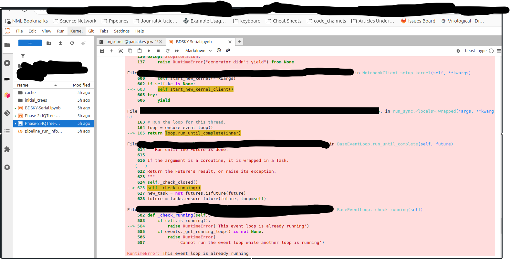

# Can only use BEAST 2.6 xmls. 
There have been some issues running BEAST 2.7 xmls on BEAST 2.6. This means that whilst the [bioconda](https://anaconda.org/bioconda/beast2)version is at 2.6 BEAST_pype can only use BEAST 2.6.* xmls. The [bioconda](https://anaconda.org/bioconda/beast2)version of BEAST can be installed via `conda install bioconda::beast2`. 

# RuntimeError: This event loop is already running:
You may run into the occaiosnal error `RuntimeError: This event loop is already running`. This tends to happen if you are running multiple instances of a workflow or different workflows at once. If this happens re-run the workflow.  
